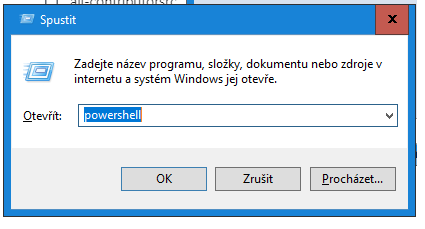

# Jak zjistit, kolik máš volného místa na disku?

## Obsah
1) [Slovník pojmů](#slovník-pojmů)
2) [Powershell](#v-powershellu-windows-781011)
2) [Windows 10](#windows-10)
2) [Ubuntu](#ubuntu-2204-matte)

## Slovník pojmů
### Disk
Existujú rôzne typy diskov, ako napríklad pevné disky (hard disk drives - HDD), ktoré používajú magnetické disky na ukladanie dát, alebo pevné disky s polovodičovými pamäťami (solid-state drives - SSD), ktoré používajú polovodičové pamäte. Disky môžu byť interné, umiestnené priamo v počítači, alebo externé, pripojené k počítaču pomocou rozhraní ako USB. Disky sú často používané na trvalé ukladanie dát, ktoré majú byť dlhodobo dostupné a uchované.

### Úložisko
Úložisko je širší termín, ktorý zahŕňa akékoľvek médium alebo zariadenie, ktoré umožňuje ukladanie dát. Okrem diskov môžu úložiská zahŕňať napríklad flash disky, pamäťové karty, CD/DVD disky, cloudové úložiská a ďalšie. Úložiská môžu byť používané na dočasné ukladanie dát alebo na zálohovanie a archiváciu dôležitých informácií. Ich účelom je poskytnúť spôsob, ako uchovať a neskôr obnoviť dáta, keď je to potrebné.

### Příkazová řádka
Rozhraní, umožňující interakci s operačním systémem pomocí příkazů

### Terminál
Program nebo zařízení, umožňující připojení k příkazové řádce

### Klávesa Windows
Klávesa též známá jako Start, Logo, OS, Super nebo Winkey. Standardně je umístěná v levé části posledního spodního řádku klávesnice typicky mezi klávesami Ctrl a Alt.

Stisk klávesy samostatně rozbalí nabídku Start. Klávesa je často využívána jako součást klávesových zkratek k provádění různých úkonů v systému. Seznam těchto zkratek lze nalézt [zde](https://support.microsoft.com/cs-cz/windows/kl%C3%A1vesov%C3%A9-zkratky-ve-windows-dcc61a57-8ff0-cffe-9796-cb9706c75eec#WindowsVersion=Windows_10)

## V powershellu (Windows 7/8/10/11)
*Tento postup vyžaduje, aby na počítači běžel operační systém Windows 7 a novější. Předpokládá se, že operační systém používá českou lokalizaci.*

1) Zmáčkni klávesovou zkratku <code>Win</code>+<code>R</code>

    *Klávesa <code>Win</code> se klávesa zpravidla umístěná mezi klávesou <code>alt</code> a <code>ctrl</code> s logem operačního systému Windows*

    <svg xmlns="http://www.w3.org/2000/svg" height="88" width="88" xmlns:v="https://vecta.io/nano"><path d="M0 12.402l35.687-4.86.016 34.423-35.67.203zm35.67 33.529l.028 34.453L.028 75.48.026 45.7zm4.326-39.025L87.314 0v41.527l-47.318.376zm47.329 39.349l-.011 41.34-47.318-6.678-.066-34.739z" fill="#00adef"/></svg>

2) Otevře se okno s názvem **Spustit**

4) Do okna s názvem Spustit zadejte "powershell"
5) Zmáčkněte klávesu ENTER 
6) Zadejte příkaz <code>Get-Volume</code>

6) Do okna powershellu se vypíše tabuľka s kolonkami "DriveLetter", "FriendlyName", "FileSystemType", "DriveType", "HealthStatus", "OperationalStatus", "SizeRemaining", "Size".
Pod "SizeRemaining" je vypísané koľko zostáva miesta na disku.

## Windows 10
*Tento postup vyžaduje, aby na počítači běžel operační systém Windows 7 a novější. Předpokládá se, že operační systém používá českou lokalizaci.*

**V případě, že jste přihlášen na účtě, který má administrátorská práva**:

1) Otevřete Průzkumníka souborů
2) Po pravé straně se nachází panel s záložkami - klikněte na "Tento počítač"

3) Otevře se vám okno, ve kterém vidíte sekce "složky" a "zařízení a jednotky"

4) V sekci "Zařízení a jednotky" vidíte jednotlivá připojená úložiště a jejich kapacity
## Ubuntu 22.04 Matte
1. Uživatel je přihlášen do počítače
2. Otevření menu - Kliknutí na ikonu s nápisem "Menu" v levém horním rohu monitoru
3. Kliknutí na "Type to search…"
4. Vyhledání "MATE Disk Usage Analyzer"
5. Otevření programu "MATE Disk Usage Analyzer" (kliněte na výsledek vyhledávání, který se objeví v pravém sloupci Menu)
6. V otevřeném okně najděte slovo "available"
nachází se v závorce vedle Total filesystem capacity v horním boxu okna (nikoli v hlavním grafickém boxu)
